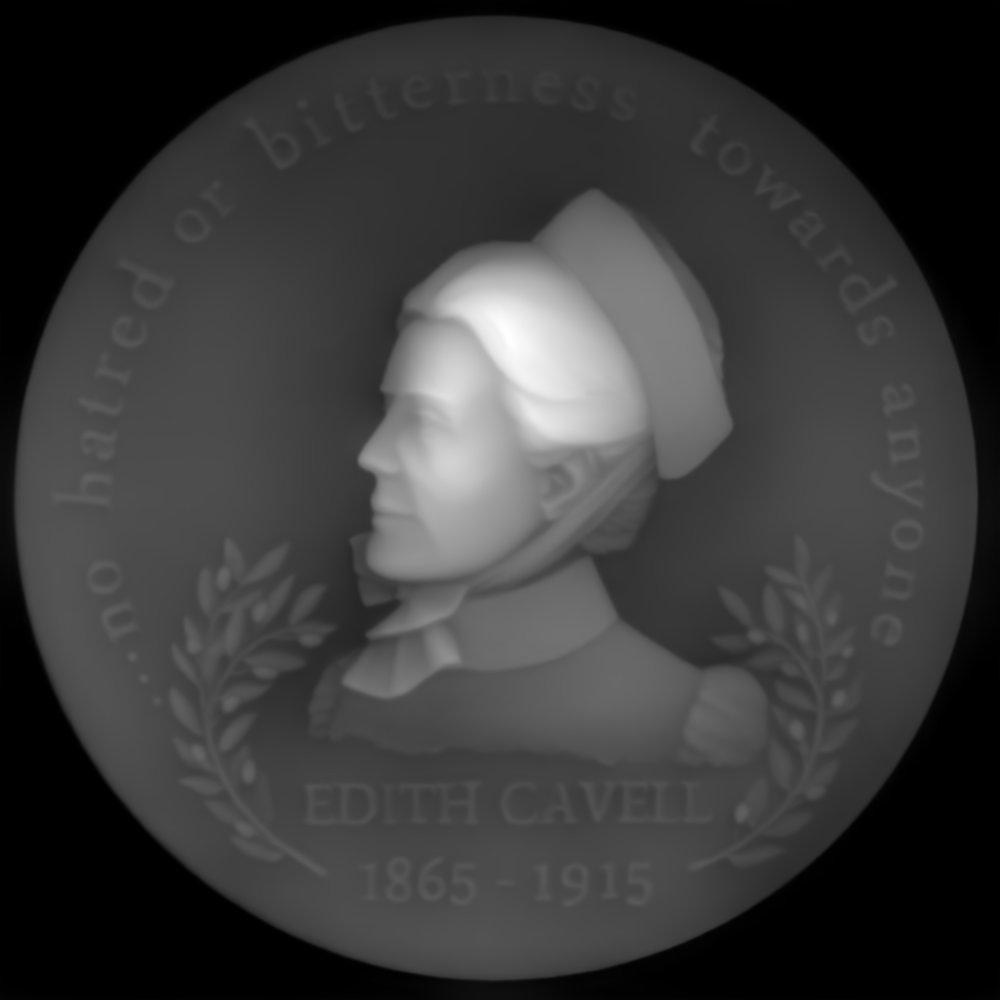
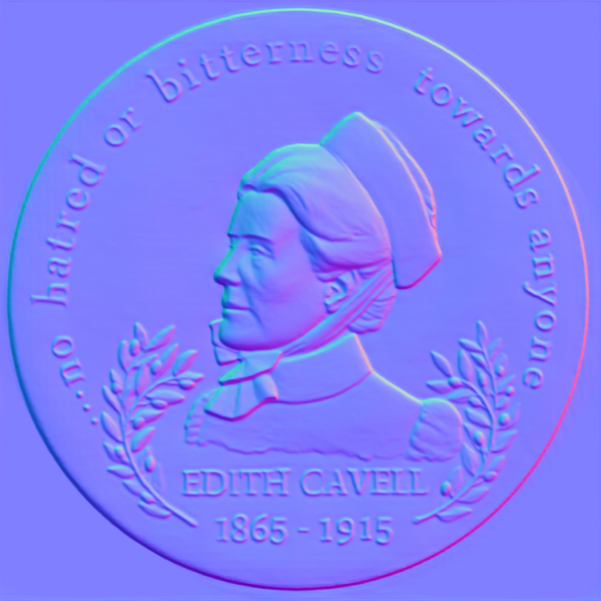

<h1>MonoRelief V2: Leveraging Real Data for High-Fidelity Monocular Relief Recovery
</h1>

[**Yu-Wei Zhang**]1*&dagger; · [**Tongju Han**]1 · [**Lipeng Gao**]1
 
[**Mingqiang Wei**]2 · [**Hui Liu**]3 · [**Changbao Li**]1 · [**Caiming Zhang**]4

1QLU&emsp;&emsp;&emsp;2NUAA;3SDUFE;4SDU
 
&dagger;project lead&emsp;*corresponding author

This work presents Depth Anything V2. It significantly outperforms [V1](https://github.com/LiheYoung/Depth-Anything) in fine-grained details and robustness. Compared with SD-based models, it enjoys faster inference speed, fewer parameters, and higher depth accuracy.

  

    

    

    

  

## News
- **2025-01-22:** [Video Depth Anything](https://videodepthanything.github.io) has been released. It generates consistent depth maps for super-long videos (e.g., over 5 minutes).
