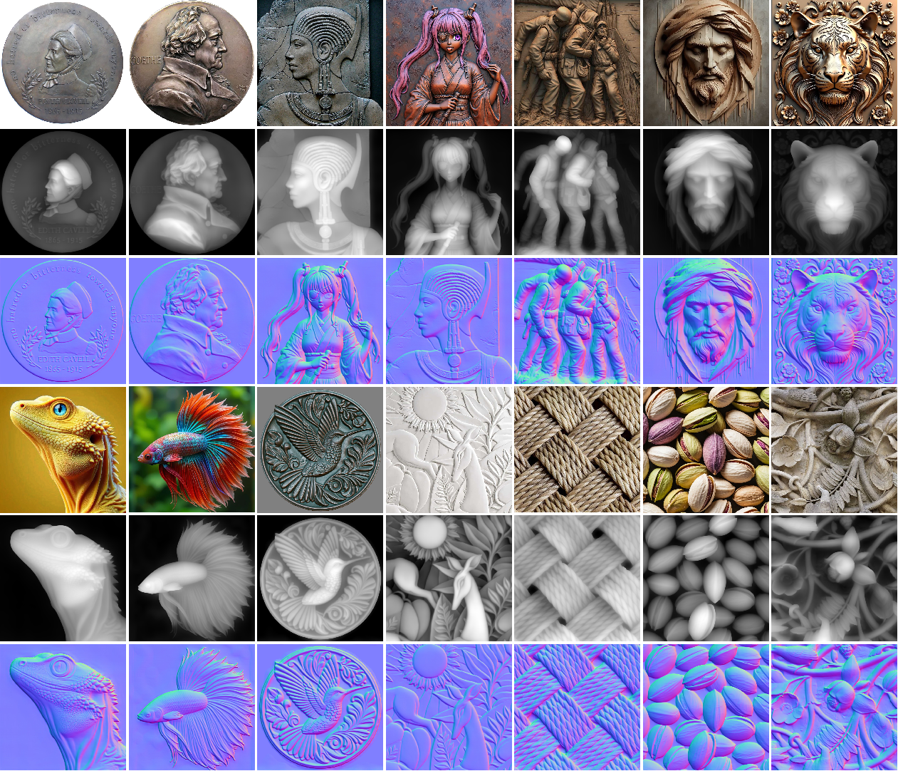

<h1>MonoRelief V2: Leveraging Real Data for High-Fidelity Monocular Relief Recovery
</h1>

[**Yu-Wei Zhang**]1*&dagger; · [**Tongju Han**]1 · [**Lipeng Gao**]1
 
[**Mingqiang Wei**]2 · [**Hui Liu**]3 · [**Changbao Li**]1 · [**Caiming Zhang**]4

1QLU&emsp;&emsp;&emsp;2NUAA&emsp;&emsp;&emsp;3SDUFE&emsp;&emsp;&emsp;4SDU
 
&dagger;project lead&emsp;*corresponding author

This paper presents MonoRelief V2, an end-to-end model designed for directly recovering 2.5D reliefs from single
images under complex material and illumination variations. 

  

    

  

## News
- **2025-08-28:** updata readme.
